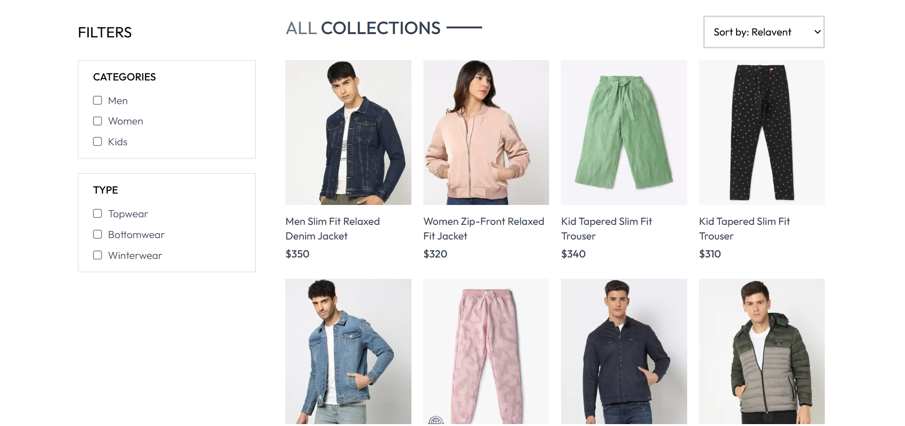
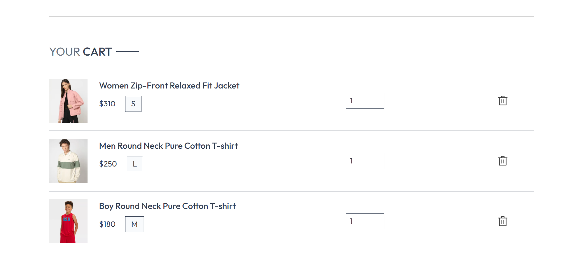
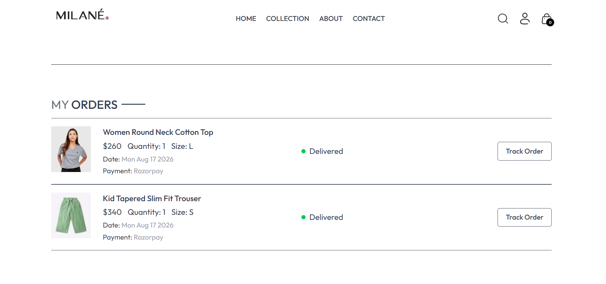
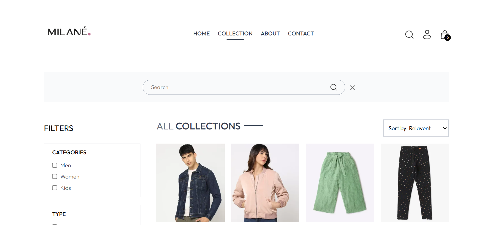
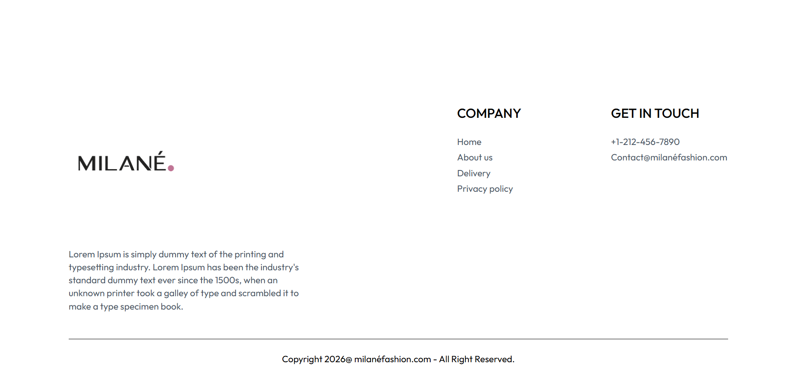

# MILANÉ — Full-Stack Fashion E-Commerce Platform

## 📖 Table of Contents

- [📝 About the Project](#-about-the-project)
- [✨ Key Features](#-key-features)
- [💻 Technologies & Tools](#-technologies--tools)
- [📸 UI Showcase](#-ui-showcase)

## 📝 About the Project

**MILANÉ** is a full-stack fashion e-commerce web application developed from the ground up. It is designed as a practical implementation of modern web development concepts, covering the complete architecture of an e-commerce platform, from the frontend interface to backend services and database management. The project provides a smooth and user-friendly shopping environment along with a dedicated administrative system for managing the platform.

This project was developed to demonstrate practical proficiency in the **MERN stack (MongoDB, Express.js, React.js, and Node.js)** and other modern web technologies used in full-stack application development.

## ✨ Key Features

- **User Authentication**: Secure user registration and login system using JSON Web Tokens (JWT).
- **Product Browsing**: Dynamic product listings with search and category-based filtering for easy product discovery.
- **Shopping Cart**: Add, remove, and update product quantities with persistent cart management.
- **Order Management**: Place orders and view order history with detailed order information.
- **Online Payments**: Integrated Razorpay to enable secure online payment processing.
- **Admin Dashboard**: Dedicated admin panel for managing products, inventory, product images, and customer orders.
- **Responsive Design**: Responsive user interface designed to provide a consistent experience across different devices.

- ## 💻 Technologies & Tools

This project is built using the MERN stack and other modern technologies:

- **Frontend**: React.js,Tailwind CSS, React Router, Axios
- **Backend**: Node.js, Express.js
- **Database**: MongoDB, Mongoose
- **Authentication**: JSON Web Token (JWT), bcrypt
- **Payment Gateway**: Razorpay
- **Development Tools**: Git, GitHub, Postman, Vite

- ## 📸 UI Showcase

Take a look at the main screens and features of the **MILANÉ** application.

<table>
  <tr>
    <th>Homepage</th>
    <th>Collections Page</th>
    <th>Product Page</th>
  </tr>
  <tr>
    <td></td>
    <td></td>
    <td></td>
  </tr>

  <tr>
    <th>Bestsellers</th>
    <th>Shopping Cart</th>
    <th>Checkout</th>
  </tr>
  <tr>
    <td></td>
    <td></td>
    <td></td>
  </tr>

  <tr>
    <th>Order Page</th>
    <th>About Us Page</th>
    <th>Contact Us Page</th>
  </tr>
  <tr>
    <td></td>
    <td></td>
    <td></td>
  </tr>

<tr>
    <th>Latest Collection</th>
    <th>Category Browsing & Sorting</th>
    <th>Sign Up / Login</th>
  </tr>
  <tr>
    <td></td>
    <td></td>
    <td></td>
  </tr>

  <tr>
    <th>Search Bar</th>
    <th>Our Policy</th>
    <th>Footer</th>
  </tr>
  <tr>
    <td></td>
    <td></td>
    <td></td>
  </tr>

  <tr>
    <th>Admin Panel - Add Items</th>
    <th>Admin Panel - Items List</th>
    <th>Admin Panel - Orders List</th>
  </tr>
  <tr>
    <td></td>
    <td></td>
    <td></td>
  </tr>
</table>

